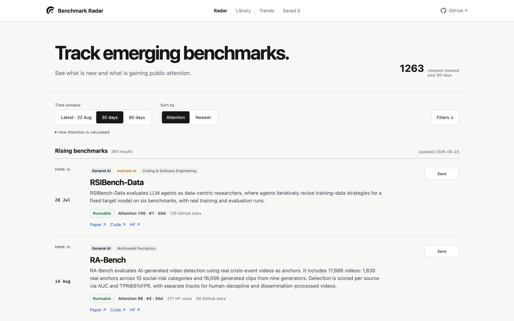

<h1 align="center"> Benchmark Radar</h1>

Track the benchmarks shaping AI. Follow new public releases and the evaluations adopted by leading model labs.

  <strong><a href="https://benchmark-radar.com/#radar">Open Radar →</a></strong>
  &nbsp;·&nbsp;
  <strong><a href="https://benchmark-radar.com/#library">Browse Library →</a></strong>
  &nbsp;·&nbsp;
  <strong><a href="https://benchmark-radar.com/#trends">Explore Trends →</a></strong>

  
  

  

## Hot this month

<!-- GENERATED_OVERVIEW_START -->
Updated 2026-08-24 · benchmarks first released in August 2026

| # | Benchmark | Field | Public signals |
|---:|---|---|---|
| 1 | **ASI-Bench** [Paper](https://arxiv.org/abs/2608.17271) · [Code](https://github.com/apexin-ai/ASI-Bench) | Agents | 60 HF votes · 132 GitHub stars · 1,615 dataset downloads |
| 2 | **RA-Bench** [Paper](https://arxiv.org/abs/2608.14391) · [Code](https://github.com/24029100313/RA-Bench) | Multimodal Perception | 277 HF votes · 61 GitHub stars |
| 3 | **PlayWorld** [Paper](https://arxiv.org/abs/2608.13552) · [Code](https://github.com/kxding/PlayWorld) | Multimodal Perception | 45 HF votes · 85 GitHub stars |
| 4 | **SWE-bench Science** [Paper](https://arxiv.org/abs/2608.19799) | Coding & Software Engineering | 61 HF votes · 52 GitHub stars |
| 5 | **GDPevo** [Paper](https://arxiv.org/abs/2608.03764) · [Code](https://github.com/Prism-Shadow/GDPevo) | Knowledge & Reasoning | 27 HF votes · 59 GitHub stars |
| 6 | **NCP-Bench** [Paper](https://arxiv.org/abs/2608.08160) · [Code](https://github.com/yingpengma/NCP-Bench) | Agents | 29 HF votes · 29 GitHub stars |
| 7 | **DataSpace** [Paper](https://arxiv.org/abs/2608.03451) · [Code](https://github.com/HKUSTDial/DataSpace) | Knowledge & Reasoning | 33 HF votes · 24 GitHub stars |
| 8 | **WorldExam** [Paper](https://arxiv.org/abs/2608.02603) · [Code](https://github.com/YuxueYang1204/worldexam) | Multimodal Perception | 34 HF votes · 21 GitHub stars |
| 9 | **PAST-Bench** [Paper](https://arxiv.org/abs/2608.04003) · [Code](https://github.com/Gen-Verse/PAST-Bench) | Knowledge & Reasoning | 33 HF votes · 22 GitHub stars |
| 10 | **VA-Judger-Bench** [Paper](https://arxiv.org/abs/2608.18607) · [Code](https://github.com/ShareLab-SII/VA-Judger) | Multimodal Perception | 11 HF votes · 51 GitHub stars |

### Explore the library

| General AI capabilities | Application fields |
|---|---|
| [Knowledge & Reasoning](https://benchmark-radar.com/#library?capability=Knowledge%20%26%20Reasoning) · 849 [Coding & Software Engineering](https://benchmark-radar.com/#library?capability=Coding%20%26%20Software%20Engineering) · 204 [Agents](https://benchmark-radar.com/#library?capability=Agents) · 249 [Multimodal Perception](https://benchmark-radar.com/#library?capability=Multimodal%20Perception) · 523 [Safety & Trustworthiness](https://benchmark-radar.com/#library?capability=Safety%20%26%20Trustworthiness) · 86 [Mathematics & Formal Sciences](https://benchmark-radar.com/#library?capability=Mathematics%20%26%20Formal%20Sciences) · 143 [Self-Evolution / RSI](https://benchmark-radar.com/#library?topic=Self-Evolution) · 9 | [Science & Research](https://benchmark-radar.com/#library?domain=Science%20%26%20Research) · 45 [Robotics & Autonomous Systems](https://benchmark-radar.com/#library?domain=Robotics%20%26%20Autonomous%20Systems) · 100 [Health & Life Sciences](https://benchmark-radar.com/#library?domain=Health%20%26%20Life%20Sciences) · 128 [Finance & Economics](https://benchmark-radar.com/#library?domain=Finance%20%26%20Economics) · 84 [Cybersecurity](https://benchmark-radar.com/#library?domain=Cybersecurity) · 37 |

**[Browse all 2,166 Library records →](https://benchmark-radar.com/#library)**
<!-- GENERATED_OVERVIEW_END -->

## What you can find

| Radar | Library | Trends |
|---|---|---|
| Newly released, public, reusable evaluation benchmarks | Established benchmarks ranked by tracked use and public evaluation coverage | Monthly benchmark activity and the benchmarks shaping each field |

Attention uses observable Hugging Face and GitHub signals. One real signal is enough to rank; missing data is not treated as zero.

The generated **[Awesome AI Benchmarks catalogue](AWESOME_BENCHMARKS.md)** provides the complete source-linked list.

<strong>Data, methodology, and project information</strong>

### Data policy

Daily release discovery checks arXiv, GitHub, Hugging Face, and OpenReview, then deduplicates candidates before semantic review. Records are linked to their original papers, projects, code, and datasets where available. Catalog discovery is attributed to BenchLM and llm-stats; release identity and corrections are checked against primary sources.

Daily updates preserve real observation dates. Benchmark Radar does not invent historical attention or adoption. It is a discovery index—not a quality endorsement, model leaderboard, or prediction guarantee.

### Project links

- [Report a correction](https://github.com/Claire1217/benchmark-radar/issues/new/choose)
- [Methodology](docs/METHODOLOGY.md)
- [Public data](data/README.md)
- [Contributing](CONTRIBUTING.md)
- [Architecture](docs/ARCHITECTURE.md)

The public website has no login, analytics, or cookies. Saved benchmarks remain in the visitor's browser.

### License status

No open-source code or data license has been selected yet. Public visibility permits inspection, but does not itself grant reuse rights. Code and third-party-derived metadata will receive separate, explicit terms before the project invites broad reuse.

