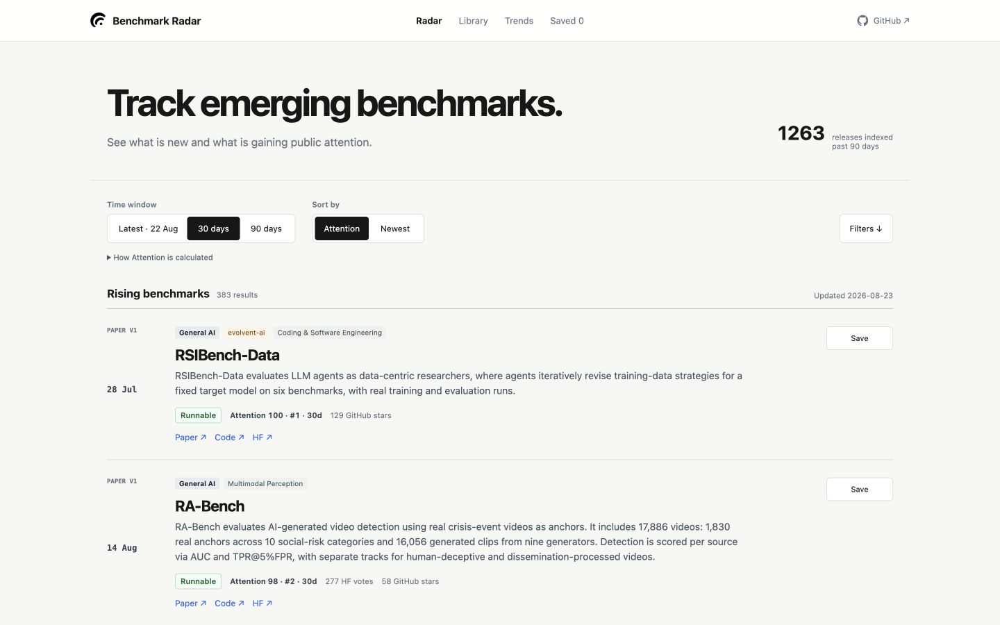

<h1 align="center"> Benchmark Radar — AI Benchmark Tracker and Library</h1>

<strong>Benchmark Radar</strong> is the official daily-updated AI benchmark tracker and searchable benchmark library. This GitHub repository powers <a href="https://benchmark-radar.com/">benchmark-radar.com</a>, indexing public evaluation benchmarks, papers, code, datasets, attention signals, and use in model reports.

  <strong><a href="https://benchmark-radar.com/">Official Benchmark Radar website →</a></strong>
  &nbsp;·&nbsp;
  <strong><a href="https://benchmark-radar.com/#radar">Open Radar →</a></strong>
  &nbsp;·&nbsp;
  <strong><a href="https://benchmark-radar.com/#library">Browse Library →</a></strong>
  &nbsp;·&nbsp;
  <strong><a href="https://benchmark-radar.com/trends/">Explore Trends →</a></strong>

  
  

  

## Hot this month

<!-- GENERATED_OVERVIEW_START -->
Updated 2026-10-22 · benchmarks first released in October 2026

| # | Benchmark | Field | Public signals |
|---:|---|---|---|
| 1 | **LongLongTextBench** [Paper](https://arxiv.org/abs/2610.23374) · [Code](https://github.com/OpenMOSS/MOSS-Image) | Image & Video Generation | 92 HF votes · 1,426 GitHub stars |
| 2 | **Graduate Admissions Agent Benchmark** [Code](https://github.com/yeyuxin777/baoyan-agent-benchmark) | Professional & Enterprise Work · Abstract Reasoning & Planning | 699 GitHub stars · 680 dataset downloads |
| 3 | **FDE-Gym** [Paper](https://arxiv.org/abs/2610.22350) · [Code](https://github.com/deeplethe/fde-gym) | Professional & Enterprise Work | 78 HF votes · 109 GitHub stars · 371 dataset downloads |
| 4 | **OmniCompass** [Paper](https://arxiv.org/abs/2610.18829) | Video Understanding | 62 HF votes · 115 GitHub stars |
| 5 | **Doc2Harness** [Paper](https://arxiv.org/abs/2610.20344) | Agent Skills & Self-Improvement · Agentic Coding & SWE | 62 HF votes · 113 GitHub stars |
| 6 | **DFM-Bench** [Paper](https://arxiv.org/abs/2610.23839) · [Code](https://github.com/Gen-Verse/DiscoveryRSI) | Science · AI R&D & ML Engineering | 20 HF votes · 127 GitHub stars |
| 7 | **AgentSWE** [Paper](https://arxiv.org/abs/2610.13361) · [Code](https://github.com/VectorSpaceLab/AgentSWE) | Agentic Coding & SWE | 92 HF votes · 43 GitHub stars |
| 8 | **ORBIA** [Paper](https://arxiv.org/abs/2610.20693) · [Code](https://github.com/worldbench/Orbia) | World Models & Physical Understanding · Video Understanding | 44 HF votes · 48 GitHub stars · 73 dataset downloads |
| 9 | **RobotWorld** [Paper](https://arxiv.org/abs/2610.10409) · [Code](https://github.com/robotworldai/robotworld) | Robotics & Embodied AI · World Models & Physical Understanding | 40 HF votes · 44 GitHub stars |
| 10 | **EgoExo-Next** [Paper](https://arxiv.org/abs/2610.04506) | Video Understanding · Spatial & 3D Reasoning | 1,388 dataset downloads |

### Explore the library

| Capabilities | Agents, safety & domains |
|---|---|
| **Reasoning & Knowledge** [Math Reasoning](https://benchmark-radar.com/#library?direction=math) · 141 [Knowledge & Expert QA](https://benchmark-radar.com/#library?direction=knowledge-expert-qa) · 155 [Abstract Reasoning & Planning](https://benchmark-radar.com/#library?direction=abstract-reasoning) · 144 [Factuality & Hallucination](https://benchmark-radar.com/#library?direction=factuality) · 116 [Forecasting & Time Series](https://benchmark-radar.com/#library?direction=forecasting) · 29  **Coding & AI R&D** [Agentic Coding & SWE](https://benchmark-radar.com/#library?direction=agentic-coding) · 313 [Code Generation](https://benchmark-radar.com/#library?direction=code-generation) · 250 [AI R&D & ML Engineering](https://benchmark-radar.com/#library?direction=ai-rnd) · 99  **Agents** [Tool Use & Function Calling](https://benchmark-radar.com/#library?direction=tool-use) · 226 [Computer Use & GUI Agents](https://benchmark-radar.com/#library?direction=computer-use) · 94 [Deep Research & Search](https://benchmark-radar.com/#library?direction=deep-research) · 153 [Professional & Enterprise Work](https://benchmark-radar.com/#library?direction=professional-work) · 245 [Agent Memory & Personalization](https://benchmark-radar.com/#library?direction=agent-memory) · 93 [Agent Skills & Self-Improvement](https://benchmark-radar.com/#library?direction=agent-skills-evolution) · 43 [Multi-Agent & Games](https://benchmark-radar.com/#library?direction=multi-agent-games) · 82  **Language & Interaction** [Long Context](https://benchmark-radar.com/#library?direction=long-context) · 102 [Instruction Following](https://benchmark-radar.com/#library?direction=instruction-following) · 58 [Chat, Writing & Preference](https://benchmark-radar.com/#library?direction=chat-writing) · 100 [Multilingual & Translation](https://benchmark-radar.com/#library?direction=multilingual) · 213  **Multimodal** [Image & Visual Reasoning](https://benchmark-radar.com/#library?direction=visual-reasoning) · 427 [Document Understanding & OCR](https://benchmark-radar.com/#library?direction=document-ocr) · 86 [Video Understanding](https://benchmark-radar.com/#library?direction=video-understanding) · 175 [Spatial & 3D Reasoning](https://benchmark-radar.com/#library?direction=spatial-3d) · 130 [Speech & Audio](https://benchmark-radar.com/#library?direction=speech-audio) · 103 [Image & Video Generation](https://benchmark-radar.com/#library?direction=image-video-generation) · 138 | **Embodied & Physical** [Robotics & Embodied AI](https://benchmark-radar.com/#library?direction=embodied-robotics) · 181 [World Models & Physical Understanding](https://benchmark-radar.com/#library?direction=world-models) · 64  **Safety & Security** [Safety & Alignment](https://benchmark-radar.com/#library?direction=safety-alignment) · 197 [Agent Security & Prompt Injection](https://benchmark-radar.com/#library?direction=agent-security) · 103 [Cybersecurity & CTF](https://benchmark-radar.com/#library?direction=cybersecurity) · 80 [AI-Content Detection & Forensics](https://benchmark-radar.com/#library?direction=content-detection) · 26  **Application domains** [Science](https://benchmark-radar.com/#library?direction=science) · 298 [Health & Medicine](https://benchmark-radar.com/#library?direction=health-medicine) · 165 [Finance & Law](https://benchmark-radar.com/#library?direction=finance-legal) · 145 [Engineering & Hardware Design](https://benchmark-radar.com/#library?direction=engineering-design) · 39  **Indexes & Suites** [Composite Indexes](https://benchmark-radar.com/#library?direction=composite-index) · 29 |

**[Browse all 3,537 Library records →](https://benchmark-radar.com/#library)**
<!-- GENERATED_OVERVIEW_END -->

## What you can find

| Radar | Library | Trends |
|---|---|---|
| Newly released, public, reusable evaluation benchmarks | Established benchmarks ranked by tracked use and public evaluation coverage | Monthly benchmark activity and the benchmarks shaping each field |

Attention uses observable Hugging Face and GitHub signals. One real signal is enough to rank; missing data is not treated as zero.

The generated **[Awesome AI Benchmarks catalogue](AWESOME_BENCHMARKS.md)** provides the complete source-linked list.

<strong>Data, methodology, and project information</strong>

### Data policy

Daily release discovery checks arXiv, GitHub, Hugging Face, and OpenReview, then deduplicates candidates before semantic review. Records are linked to their original papers, projects, code, and datasets where available. Catalog discovery is attributed to BenchLM and llm-stats; release identity and corrections are checked against primary sources.

Daily updates preserve real observation dates. Benchmark Radar does not invent historical attention or adoption. It is a discovery index—not a quality endorsement, model leaderboard, or prediction guarantee.

### Project links

- [Report a correction](https://github.com/Claire1217/benchmark-radar/issues/new/choose)
- [Methodology](docs/METHODOLOGY.md)
- [Public data](data/README.md)
- [Contributing](CONTRIBUTING.md)
- [Architecture](docs/ARCHITECTURE.md)

The public website has no login, analytics, or cookies. Saved benchmarks remain in the visitor's browser.

### License status

No open-source code or data license has been selected yet. Public visibility permits inspection, but does not itself grant reuse rights. Code and third-party-derived metadata will receive separate, explicit terms before the project invites broad reuse.

## Agent CLI

Query benchmark usage evidence with `./benchmark-reader search gpqa` and `./benchmark-reader show lib_gpqa_diamond`. Use `./benchmark-reader daily` for daily releases and `./benchmark-reader hot --window 7d` (or `90d`) for hot lists. Add keywords, `--domain`, or `search --sort attention`. All queries return JSON for Agents; `--json` is optional. Use `--help` for commands and examples. See the [CLI contract and data definitions](docs/CLI.md) for source coverage, version alignment, pagination and unknown values.
