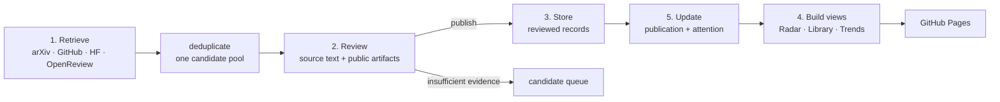

# Architecture

Benchmark Radar is a static website with a scheduled data pipeline. Git is the
database, GitHub Actions runs the update, and GitHub Pages serves the generated
files. No application server is required for the current product.

## End-to-end flow



The numbering follows the product concepts. In the daily execution order,
updates happen before the public views are rebuilt so users receive one
consistent snapshot.

## What each stage does

| Stage | Job | Main code | Persistent data | Runs automatically? |
|---|---|---|---|---|
| 1. Retrieve | Build one dated candidate pool from arXiv, newly created GitHub repositories, Hugging Face datasets, and OpenReview submissions. Require enough source text to support review, then deduplicate by source ID, official URL, and normalized benchmark family name. Source filters never make the publication decision. On arXiv's Friday/Saturday no-announcement dates, only the other three adapters run. | `pipeline/discover_benchmarks.py`, `pipeline/index_benchmarks.py`; historical arXiv replay: `pipeline/backfill_index.py` | `data/review_queue.json`, `data/runs/*.json` | Yes, daily |
| 2. Review | DeepSeek checks supplied Paper text and bounded official project/GitHub/Hugging Face excerpts. It decides whether the artifact is `score_submission`, `viewpoint_probe`, or `unclear`, and drafts third-person display copy. Unknown evidence stays unknown. | `pipeline/generate_editorial_copy.py`; policy: `docs/METHODOLOGY.md` | Decisions and copy: `data/editorial_copy.json`; unresolved candidates remain in `data/review_queue.json` | Yes; source-backed maintainer corrections are separate |
| 3. Store | Admit eligible reviewed releases or apply a narrowly scoped source-backed correction. Stable source IDs prevent duplicates, and deterministic validators control canonical output. | `pipeline/generate_editorial_copy.py`, `pipeline/apply_overrides.py`; merge helpers in `pipeline/index_benchmarks.py` | Additions: `data/curated_records.json`; corrections: `data/curated_overrides.json`; canonical output: `data/benchmarks.json` | Yes |
| 4. Display | Produce a small Radar index, the all-time Library union, domain release trends, the Awesome list, and the static site. | `pipeline/generate_public_index.py`, `pipeline/build_library_records.py`, `pipeline/generate_library_index.py`, `pipeline/generate_domain_trends.py`, `pipeline/generate_awesome.py`, `pipeline/build_github_pages.py`; frontend: `web/` | `data/benchmarks_index.json`, `data/library_index.json`, `data/domain_trends.json`, `AWESOME_BENCHMARKS.md` | Yes, every successful update |
| 5. Update | Refresh author-reported venue metadata and current Hugging Face/GitHub signals. Store dated observations, preserve the last valid value on source failure, and recompute Latest/30d/90d ranking. | `pipeline/enrich_publications.py`, `pipeline/enrich_metrics.py` | `data/publication/*.json`, `data/metrics/*.json`, enriched fields in `data/benchmarks.json` | Yes, daily |

## How review reaches the website

```text
review_queue candidate
  -> automated multi-source evidence review
  -> editorial_copy decision
  -> curated_records (eligible record) or curated_overrides (maintainer correction)
  -> benchmarks.json
  -> benchmarks_index.json / library_index.json / domain_trends.json
  -> web/app.js
```

The website never reads the review queue. A candidate becomes visible only
after it exists in canonical data and the generated public views pass
validation.

`evaluationMode` affects display priority, not factual attention values:

- `score_submission` or another reusable public benchmark: publishable;
- `viewpoint_probe`: retained as review evidence but not published;
- `unclear`: not published.

Readiness is separate. A record can be `Paper only`, `Inspectable`, or
`Runnable` regardless of whether it is a score-submission benchmark or a
viewpoint probe.

## Daily schedule and publishing

`.github/workflows/daily-index.yml` runs once at 15:17 Brisbane time. This is
buffered beyond arXiv's nightly OAI update in both US daylight and standard
time. It targets the previous Brisbane calendar day. GitHub, Hugging Face, and
OpenReview discovery runs every day; arXiv discovery runs only on its scheduled
announcement dates. A source failure is recorded without inventing an empty
release date or blocking healthy adapters.
The job performs:

```text
retrieve -> update candidate queue -> semantic review -> reconcile canonical data
-> publication metadata -> attention snapshot -> generate all public views
-> validate -> one Git commit
```

The Pages workflow builds from the committed `main` branch. If retrieval,
generation, or validation fails, the new snapshot is not committed and the
previous website stays online. CI separately runs the pipeline tests and static
build for pushes and pull requests.

## Radar, Library, and Trends

- **Radar** reads `benchmarks_index.json`. Latest, 30 days, and 90 days are
  rolling release-date filters over reviewed records.
- **Library** reads `library_index.json`, the union of reviewed Radar records
  and established editorial seeds. A daily Radar record therefore also appears
  in Library; an old Library seed does not appear in Latest/30d/90d.
- **Trends** reads `domain_trends.json`. It foregrounds the Benchmarks with the
  strongest current tracked use and uses monthly release activity only as
  context. It does not equate release count with deployment or technical
  progress; historical adoption and saturation wait for comparable dated data.
- **Saved** is browser-local `localStorage`; it is not part of the data
  pipeline and does not require a server.

## Current boundary

The current system is deliberately small: one static frontend, one daily
workflow, bounded public-source adapters, and JSON data in Git. Discovery is
not exhaustive web crawling; it uses dated official APIs and records adapter
failures explicitly.
