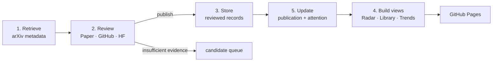

# Architecture

Benchmark Radar is a static website with a scheduled data pipeline. Git is the
database, GitHub Actions runs the update, and GitHub Pages serves the generated
files. No application server is required for the current product.

## End-to-end flow



The numbering follows the product concepts. In the daily execution order,
updates happen before the public views are rebuilt so users receive one
consistent snapshot.

## What each stage does

| Stage | Job | Main code | Persistent data | Runs automatically? |
|---|---|---|---|---|
| 1. Retrieve | Fetch the previous Brisbane calendar day's papers from selected arXiv categories; extract stable IDs, dates, source text, and links; place plausible candidates in a persistent queue. Keyword rules are recall filters, not publication decisions. | `pipeline/scheduled_source_date.py`, `pipeline/index_benchmarks.py`; historical replay: `pipeline/backfill_index.py` | `data/review_queue.json`, `data/runs/*.json` | Yes, daily |
| 2. Review | Check the Paper, official project/GitHub, and Hugging Face. Decide whether the artifact is `score_submission`, `viewpoint_probe`, or `unclear`; record code/data/evaluator/submission availability. Unknown evidence stays unknown. | Review policy: `docs/METHODOLOGY.md`; reviewed additions and fixes are represented directly as data, without a separate AI state machine. | Proposed candidates remain in `data/review_queue.json` | Source verification is currently a curated step |
| 3. Store | Add a verified release or patch an indexed record. Stable source IDs prevent duplicates. These files are the only bridge from review into canonical data. | `pipeline/apply_overrides.py`; merge helpers in `pipeline/index_benchmarks.py` | Additions: `data/curated_records.json`; corrections: `data/curated_overrides.json`; canonical output: `data/benchmarks.json` | Merge is automatic; adding review evidence is curated |
| 4. Display | Produce a small Radar index, the all-time Library union, domain release trends, the Awesome list, and the static site. | `pipeline/generate_public_index.py`, `pipeline/build_library_records.py`, `pipeline/generate_library_index.py`, `pipeline/generate_domain_trends.py`, `pipeline/generate_awesome.py`, `pipeline/build_github_pages.py`; frontend: `web/` | `data/benchmarks_index.json`, `data/library_index.json`, `data/domain_trends.json`, `AWESOME_BENCHMARKS.md` | Yes, every successful update |
| 5. Update | Refresh author-reported venue metadata and current Hugging Face/GitHub signals. Store dated observations, preserve the last valid value on source failure, and recompute Latest/30d/90d ranking. | `pipeline/enrich_publications.py`, `pipeline/enrich_metrics.py` | `data/publication/*.json`, `data/metrics/*.json`, enriched fields in `data/benchmarks.json` | Yes, daily |

## How review reaches the website

```text
review_queue candidate
  -> Paper/GitHub/HF source check
  -> curated_records (new record) or curated_overrides (correction)
  -> benchmarks.json
  -> benchmarks_index.json / library_index.json / domain_trends.json
  -> web/app.js
```

The website never reads the review queue. A candidate becomes visible only
after it exists in canonical data and the generated public views pass
validation.

`evaluationMode` affects display priority, not factual attention values:

- `score_submission`: normal priority;
- `viewpoint_probe`: slightly lower ordering priority;
- `unclear`: not published.

Readiness is separate. A record can be `Paper only`, `Inspectable`, or
`Runnable` regardless of whether it is a score-submission benchmark or a
viewpoint probe.

## Daily schedule and publishing

`.github/workflows/daily-index.yml` runs at 14:17 Brisbane time and processes
the previous Brisbane calendar day. The job performs:

```text
retrieve -> update candidate queue -> publication metadata -> attention snapshot
-> generate all public views -> validate -> one Git commit
```

The Pages workflow builds from the committed `main` branch. If retrieval,
generation, or validation fails, the new snapshot is not committed and the
previous website stays online. CI separately runs the pipeline tests and static
build for pushes and pull requests.

## Radar, Library, and Trends

- **Radar** reads `benchmarks_index.json`. Latest, 30 days, and 90 days are
  rolling release-date filters over reviewed records.
- **Library** reads `library_index.json`, the union of reviewed Radar records
  and established editorial seeds. A daily Radar record therefore also appears
  in Library; an old Library seed does not appear in Latest/30d/90d.
- **Trends** reads `domain_trends.json`. It foregrounds the Benchmarks with the
  strongest current tracked use and uses monthly release activity only as
  context. It does not equate release count with deployment or technical
  progress; historical adoption and saturation wait for comparable dated data.
- **Saved** is browser-local `localStorage`; it is not part of the data
  pipeline and does not require a server.

## Current boundary

The current system is deliberately small: one static frontend, one daily
workflow, and JSON data in Git. It does not yet automatically crawl every
project page, GitHub repository, or Hugging Face dataset during semantic
review. That can be added later as a bounded review assistant without changing
the four-stage public data contract above.
