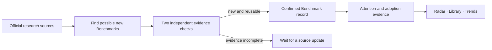
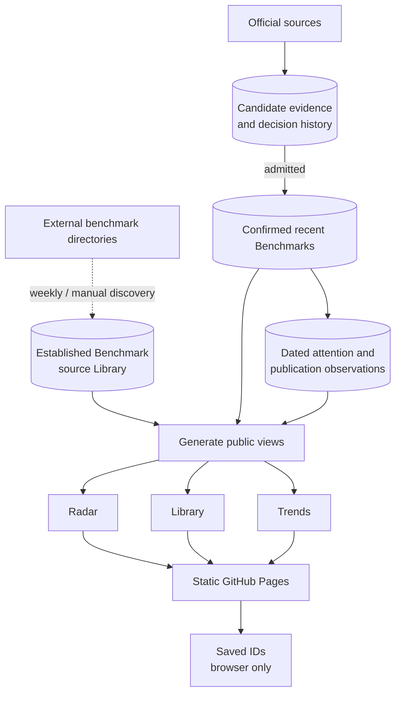
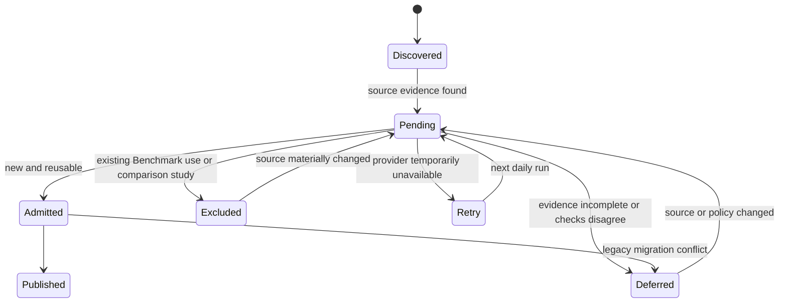
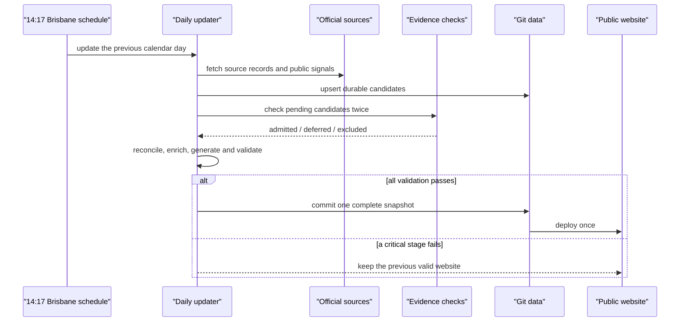

# Benchmark Radar diagrams

Each diagram answers one question. The overview is for any reader; the other
three belong in technical documentation rather than the public product UI.

## 1. Thirty-second product overview

**Question:** how does research become a record in Benchmark Radar?

The system follows primary sources, checks whether the work defines a new and
reusable evaluation target, and only then exposes it to the product views.

## 2. Storage and public-view boundary

**Question:** what is durable evidence, what is generated, and what reaches the
browser?

The frontend reads only compact generated views. It never receives candidate
abstracts, AI responses, credentials, or internal decision history. Saved items
are stable IDs in browser localStorage and never mutate the dataset.

| Logical data | Current files | Authority |
|---|---|---|
| Candidate evidence and decisions | `data/review_queue.json`, `data/ai_review_status.json` | Durable admission state |
| Confirmed recent Benchmarks | `data/benchmarks.json` | Canonical Radar data |
| Established source Library | `data/library_seed_records.json`, `data/library_records.json` | Source-backed classic records |
| Dated observations | `data/metrics/`, `data/publication/` | Historical evidence snapshots |
| Source-backed corrections | `data/curated_overrides.json` | Durable correction layer |
| Radar, Library and Trends views | `data/benchmarks_index.json`, `data/library_index.json`, `data/domain_trends.json` | Rebuildable derived data |
| Website artifact | `_site/` | Rebuildable deployment output |

## 3. Candidate lifecycle

**Question:** why does a candidate not immediately appear on the homepage?

Deferred is not rejected. Infrastructure failures automatically retry. Excluded
items retain an audit receipt, and one automated diagnostic judgment cannot
delete an already-public legacy record.

## 4. One daily update

**Question:** what happens at the fixed update time, and what happens on failure?

The scheduled run is fixed at 14:17 Australia/Brisbane and indexes the previous
Brisbane calendar day. A manual run may provide an explicit date.

## Common diagram types and where to use them

| Diagram | What it normally explains | Use here |
|---|---|---|
| System context | Product boundary and main actors | Repository overview |
| Data-flow / lineage | Sources, storage, transformations and outputs | Architecture documentation |
| State machine | Lifecycle and decision outcomes | Admission methodology |
| Sequence diagram | Runtime order, retries and failure behavior | Operations documentation |
| Entity-relationship diagram | Family, release, protocol and observation schema | Add later to data-schema documentation |
| Deployment diagram | Services, networks and credential boundaries | Add only if infrastructure grows beyond Actions + Pages |
| Funnel / Sankey | Candidate counts lost at each stage | Later monitoring view, only with real counts |

Do not put all four diagrams on the product homepage. The public UI should stay
focused on Benchmarks; these diagrams are repository documentation.
